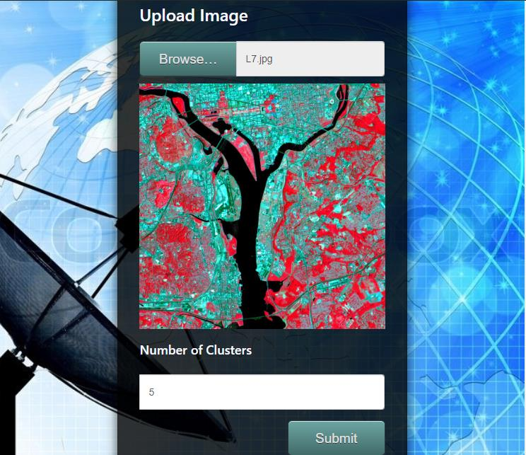
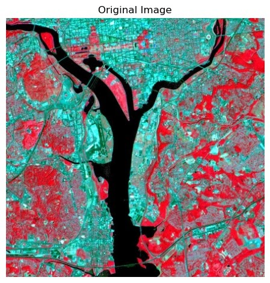
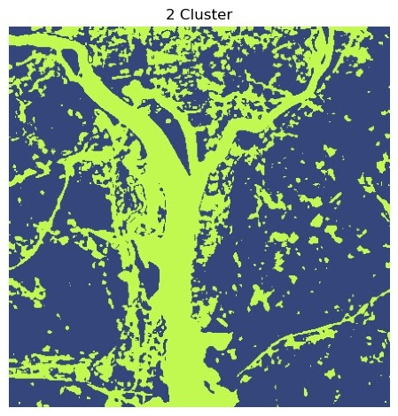

# Fuzzy Clustering

### Follow the steps to run the application: 

1. Install **Python3, Pip3** 

2. Create and activate virtual environment (preferred)    

3. To install all the dependent packages run  **"python -m pip install -r requirements.txt"**  

4. Run the app file by command  **"flask run"**   

5. Start the application on **"http://localhost:5000"**

6. Select a satellite image    

7. Specify the number of clusters

8. Hit Submit    

9. Wait for EM Algorithm to find n no. of Fuzzy Clusters in the image

10.Output displayed 

         
